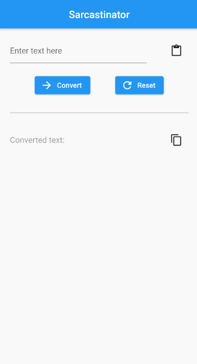

# About

The sarcastinator app is a simple app that takes a regular text and ConVeRts iT iNtO mOcKIng sPoNgEBoB teXT.

The app makes sure that all 'i' are always lowercase and all 'L' are always uppercase to prevent any confusion.

<i>If you wish to use this app on your android phone, you can copy the .apk file from the build folder to your phone and install the app. 

[Note: the app is not digitally signed and published on play store.]</i>

<h2>Demonstration</h2>

